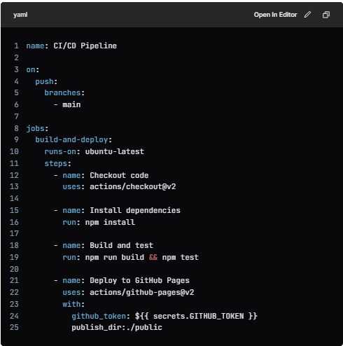

# SE-Assignment-4
Assignment: GitHub and Visual Studio
Instructions:
Answer the following questions based on your understanding of GitHub and Visual Studio. Provide detailed explanations and examples where appropriate.

Questions:
Introduction to GitHub:

What is GitHub, and what are its primary functions and features? Explain how it supports collaborative software development.
GitHub is an online platform that helps software developers work together on projects. It provides tools for organizing and controlling changes to code, enabling seamless collaboration. GitHub serves as a central hub where developers can store, track, and share their code, fostering collaborative software development and code management.

Repositories on GitHub:

What is a GitHub repository? Describe how to create a new repository and the essential elements that should be included in it.
On GitHub, a repository acts as a central hub that houses all the code related to a particular project.

*   **Code**: The actual source code for the project.
    
*   **README**: A file that provides an introduction to the project, its purpose, and how to use it.
    
*   **Issues**: A list of bugs, features, or tasks related to the project.
    
*   **Pull Requests**: Proposed changes to the project's code, which can be reviewed and approved by others.
    
*   **Branches**: Separate lines of development, such as a "main" branch for the stable codebase and a "feature" branch for new features.
    
*   **Commits**: A record of changes made to the code, including who made the changes and when.
    
*   **Contributors**: A list of developers who have contributed to the project

Version Control with Git:

Explain the concept of version control in the context of Git. How does GitHub enhance version control for developers?
*   Version control is a tool that lets you manage updates to files over time. In Git, it helps developers keep track of changes to code, work together on projects, and have a history of all the modifications that have been made
*   GitHub enhances Git's version control features by introducing a cloud-based platform. This platform enables developers to collaborate effectively, manage versions of their code, and track changes. As a result, developers can seamlessly work together, maintain code quality, and streamline their development workflow.

Branching and Merging in GitHub:

What are branches in GitHub, and why are they important? Describe the process of creating a branch, making changes, and merging it back into the main branch.
*   In GitHub, a branch resembles a distinct development path that veers away from the primary codebase (commonly referred to as the "master" branch). It allows programmers to pursue novel features, bug fixes, or experimental endeavors autonomously without jeopardizing the code dedicated to actual production.
*   **Creating a Branch, Making Changes, and Merging:**
    
*   Here's the step-by-step process:
    
*   **1\. Create a Branch:**
    
*   Go to your GitHub repository and click on the "Branch" button.
    
*   Enter a name for your new branch (e.g., "feature/new-login-system" or "fix/bug-123").
    
*   Click "Create branch" to create a new branch from the current commit.
    
*   **2\. Make Changes:**
    
*   Switch to your new branch by clicking on the branch name in the GitHub interface or by running
    

*   **git checkout**
    

*   in your terminal.
    
*   Make changes to your code, commit them, and push them to GitHub.
    
*   **3\. Review and Test:**
    
*   Share your branch with others for review and testing.
    
*   Use GitHub's pull request feature to request feedback and approval from others.
    
*   **4\. Merge into Main Branch:**
    
*   Once your changes are approved, you can merge your branch into the main branch (usually "master").
    
*   Go to your GitHub repository and click on the "Pull requests" tab.
    
*   Click on the pull request associated with your branch and click "Merge pull request".
    
*   Confirm that you want to merge the changes into the main branch.
    
*   **5\. Delete the Branch (Optional):**
    
*   After merging, you can delete the branch to keep your repository organized.
    
*   Go to your GitHub repository and click on the "Branch" button.
    
*   Click on the "Delete branch" button next to your merged branch.

Pull Requests and Code Reviews:

What is a pull request in GitHub, and how does it facilitate code reviews and collaboration? Outline the steps to create and review a pull request.
A pull request is a proposal to make changes to a GitHub repository. It's like a suggestion to merge your changes into the main codebase. This gives others a chance to review and approve your work before it becomes part of the main code. Pull requests make it easy for teams to collaborate, discuss code changes, and ensure code quality.

GitHub Actions:

Explain what GitHub Actions are and how they can be used to automate workflows. Provide an example of a simple CI/CD pipeline using GitHub Actions.
GitHub Actions is a tool that helps you streamline your software development process by automating the following steps: * Building your code (translating it into a format that can run on a computer). * Testing your code (checking for any errors or unintended behavior). * Deploying your code (making it available to users). Using GitHub Actions eliminates the need for manual intervention in these tasks, making sure that your code is always built, tested, and deployed in a consistent and efficient way, reducing the chances of errors and increasing the reliability of your software.

Example of a simple CI/CD pipeline using GitHub Actions:

Let's create a simple CI/CD pipeline that builds, tests, and deploys a Node.js application to a GitHub Pages site.

Step 1: Create a GitHub Actions workflow file

In your repository, create a new file in the .github/workflows directory, e.g., .github/workflows/ci-cd.yml. This file will define the workflow.

Introduction to Visual Studio:

What is Visual Studio, and what are its key features? How does it differ from Visual Studio Code?
 
Visual Studio is a powerful all-in-one development environment for handling substantial, multifaceted software endeavors. On the other hand, Visual Studio Code is a streamlined code editor that's perfect for more modest projects, coding endeavors, and debugging tasks.
**Key Features of Visual Studio Code:**

*   **Code Editor** : A fast and feature-rich code editor with syntax highlighting, code completion, and code refactoring capabilities.
    
*   **Extensions**: A large collection of extensions, which can be used to add new languages, themes, and functionality to the editor.
    
*   **Debugging**: Integrated debugging tools, including breakpoints, debugging windows, and diagnostic tools.
    
*   **Version Control**: Integrated version control systems, including Git and SVN.
    
*   **Lightweight**: VS Code is designed to be lightweight and fast, making it suitable for development on a wide range of devices.

**Key differences between Visual Studio and Visual Studio Code:**

1.  **Complexity**: Visual Studio is a more comprehensive and complex IDE, while VS Code is a lightweight code editor.
    
2.  **Project Templates**: Visual Studio provides pre-built project templates, while VS Code does not.
    
3.  **Designers and Builders**: Visual Studio includes visual designers and builders, while VS Code does not.
    
4.  **Database Tools**: Visual Studio includes integrated database tools, while VS Code does not.
    
5.  **Cloud and Azure Integration**: Visual Studio has tighter integration with Microsoft Azure, while VS Code has more general cloud support.
    
6.  **Extensions**: Both Visual Studio and VS Code have extensions, but VS Code's extension ecosystem is more extensive and flexible.

Integrating GitHub with Visual Studio:

Describe the steps to integrate a GitHub repository with Visual Studio. How does this integration enhance the development workflow?
Connecting GitHub to Visual Studio enhances the development process, enabling developers to: * **Streamline Workflows:** Integration simplifies the workflow, making development more efficient. * **Accelerate Delivery:** Improved efficiency reduces time spent on development, speeding up software delivery. * **Enhance Software Quality:** Integration aids in maintaining high software standards throughout the development process.
**Integrating a GitHub Repository with Visual Studio:**

Here are the steps to integrate a GitHub repository with Visual Studio:

**Step 1: Install the GitHub Extension**

1.  Open Visual Studio and navigate to **Extensions** > **Manage Extensions**.
    
2.  Search for "GitHub" in the Extensions marketplace.
    
3.  Install the "GitHub Extension for Visual Studio" extension.
    

**Step 2: Connect to GitHub**

1.  Open Visual Studio and navigate to **Team Explorer**.
    
2.  Click on **Connect** and select **GitHub**.
    
3.  Enter your GitHub credentials to authenticate.
    
4.  Authorize Visual Studio to access your GitHub account.
    

**Step 3: Clone the Repository**

1.  In Team Explorer, click on **Clone**.
    
2.  Enter the URL of your GitHub repository or search for it.
    
3.  Select the repository and click **Clone**.
    

**Step 4: Configure the Repository**

1.  In Team Explorer, click on **Home**.
    
2.  Select the cloned repository and click **Configure**.
    
3.  Set up the repository settings, such as the default branch and commit message format.
    

**Enhanced Development Workflow:**

Integrating a GitHub repository with Visual Studio enhances the development workflow in several ways:

1.  **Version Control**: Visual Studio provides a seamless integration with GitHub, allowing you to manage your codebase using Git.
    
2.  **Collaboration**: Multiple developers can work on the same project, and Visual Studio will automatically sync changes with the GitHub repository.
    
3.  **Code Review**: Visual Studio allows you to create pull requests and perform code reviews directly within the IDE.
    
4.  **Automated Builds and Deployments**: You can set up automated builds and deployments using GitHub Actions, which can be triggered from within Visual Studio.
    
5.  **Real-time Feedback**: Visual Studio provides real-time feedback on code changes, allowing you to identify and fix issues quickly.
    
6.  **Streamlined Workflow**: The integration eliminates the need to switch between multiple tools, providing a streamlined workflow that saves time and increases productivity.

Debugging in Visual Studio:

Explain the debugging tools available in Visual Studio. How can developers use these tools to identify and fix issues in their code?
Visual Studio provides a comprehensive set of debugging tools to help developers identify and fix issues in their code. These tools include:

1.  **Breakpoints**: Allow developers to pause the execution of their code at a specific point, enabling them to inspect variables, expressions, and memory.
    
2.  **Debugging Windows**: Provide real-time information about the application's state, including:
    
3.  **Step Through Code**: Enables developers to execute their code line-by-line, allowing them to observe the flow of execution and identify issues.
    
4.  **Debugging Modes**: Visual Studio offers various debugging modes, including:
    
    *   **Normal**: The default debugging mode, which allows developers to debug their code as usual.
        
    *   **Mixed Mode**: Allows developers to debug both managed and native code.
        
    *   **Native Mode**: Enables developers to debug native code only.
        
5.  **Exception Handling**: Visual Studio provides tools to handle and debug exceptions, including:
    
    *   **Exception Settings**: Allows developers to configure which exceptions to break on.
        
    *   **Exception Helper**: Provides information about the exception, including the type, message, and stack trace.
        
6.  **Diagnostic Tools**: Offer additional insights into the application's behavior, including:
    
    *   **CPU Usage**: Displays the CPU usage of the application.
        
    *   **Memory Usage**: Displays the memory usage of the application.
        
    *   **GPU Usage**: Displays the GPU usage of the application (for graphics-intensive applications).
        
7.  **Code Analysis**: Visual Studio provides code analysis tools, such as:
    
    *   **CodeLens**: Displays information about the code, including references, definitions, and changes.
        
    *   **Code Metrics**: Calculates metrics about the code, such as complexity, maintainability, and performance.
        

**Using Debugging Tools to Identify and Fix Issues:**

Developers can use these debugging tools to identify and fix issues in their code by following these steps:

1.  **Set Breakpoints**: Set breakpoints at specific points in the code to pause execution and inspect variables and expressions.
    
2.  **Step Through Code**: Use the step-through feature to execute the code line-by-line, observing the flow of execution and identifying issues.
    
3.  **Inspect Variables and Expressions**: Use the debugging windows to inspect the values of variables and expressions, identifying any unexpected or incorrect values.
    
4.  **Analyze Exception Information**: Use the exception handling tools to analyze exception information, identifying the type, message, and stack trace of the exception.
    
5.  **Use Diagnostic Tools**: Use the diagnostic tools to gain insights into the application's behavior, identifying performance bottlenecks, memory leaks, or other issues.
    
6.  **Perform Code Analysis**: Use code analysis tools to identify potential issues, such as complexity, maintainability, or performance problems.
    
7.  **Fix Issues**: Based on the information gathered, fix the identified issues, and then re-run the application to verify that the issues are resolved.

Collaborative Development using GitHub and Visual Studio:

Discuss how GitHub and Visual Studio can be used together to support collaborative development. Provide a real-world example of a project that benefits from this integration.
GitHub and Visual Studio can be used together to support collaborative development by providing a seamless integration between the two platforms. Here's how:

1.  **Version Control**: GitHub provides a centralized version control system, allowing multiple developers to work on the same codebase simultaneously.
    
2.  **Code Review**: GitHub's pull request feature enables developers to review each other's code, ensuring that changes meet the project's standards and requirements.
    
3.  **Real-time Collaboration**: Visual Studio's Live Share feature allows multiple developers to collaborate on the same code in real-time, making it easier to work together on complex tasks.
    
4.  **Automated Builds and Deployments**: GitHub Actions can be used to automate builds, tests, and deployments, ensuring that changes are properly tested and deployed to production.
    

**Real-World Example:**

Let's consider a real-world example of a project that benefits from the integration of GitHub and Visual Studio:

**Project:** OpenStreetMap (OSM) Editor

**Description:** OSM is a collaborative project to create a free editable map of the world. The OSM Editor is a web-based application that allows users to contribute to the map by editing and adding new data.

**Collaborative Development:**

The OSM Editor project uses GitHub as its version control system, with multiple developers contributing to the codebase. Here's how they use GitHub and Visual Studio together:

1.  **Code Review**: Developers create pull requests to review each other's code, ensuring that changes meet the project's standards and requirements.
    
2.  **Real-time Collaboration**: Using Visual Studio's Live Share feature, developers can collaborate on the same code in real-time, making it easier to work together on complex tasks.
    
3.  **Automated Builds and Deployments**: GitHub Actions are used to automate builds, tests, and deployments, ensuring that changes are properly tested and deployed to production.

Submission Guidelines:
Your answers should be well-structured, concise, and to the point.
Provide real-world examples or case studies wherever possible.
Cite any references or sources you use in your answers.
Submit your completed assignment by [due date].
